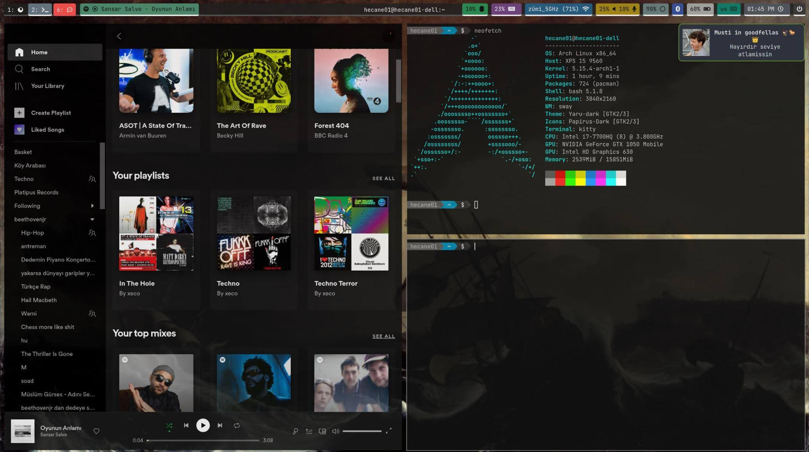

# dotfiles
A collection of my configuration files for Arch Linux.

## Dependencies

* [yaru-gtk-theme](https://aur.archlinux.org/packages/yaru-gtk-theme/)
* [papirus-icon-theme](https://www.archlinux.org/packages/community/any/papirus-icon-theme/)
* [nerd-fonts-complete](https://aur.archlinux.org/packages/nerd-fonts-complete)
* [powerline-shell](https://aur.archlinux.org/packages/powerline-shell/)
* [pipewire](https://archlinux.org/packages/extra/x86_64/pipewire/)
* [pamixer](https://archlinux.org/packages/community/x86_64/pamixer/)
* [playerctl](https://www.archlinux.org/packages/community/x86_64/playerctl/)
* [blueman](https://archlinux.org/packages/community/x86_64/blueman/)
* [nano-syntax-highlighting](https://www.archlinux.org/packages/community/any/nano-syntax-highlighting/)
* [i3wm](https://www.archlinux.org/packages/community/x86_64/i3-wm/)
* [kitty](https://archlinux.org/packages/community/x86_64/kitty/)
* [feh](https://www.archlinux.org/packages/extra/x86_64/feh/)
* [polybar](https://aur.archlinux.org/packages/polybar)
* [picom](https://www.archlinux.org/packages/community/x86_64/picom/)
* [dunst](https://www.archlinux.org/packages/community/x86_64/dunst/)
* [rofi](https://www.archlinux.org/packages/community/x86_64/rofi/)
* [i3lock-color](https://aur.archlinux.org/packages/i3lock-color)
* [xorg-xrandr](https://www.archlinux.org/packages/extra/x86_64/xorg-xrandr/)
* [autorandr](https://www.archlinux.org/packages/community/any/autorandr/)
* [xorg-xbacklight](https://www.archlinux.org/packages/extra/x86_64/xorg-xbacklight/)
* [flameshot](https://archlinux.org/packages/community/x86_64/flameshot/)

