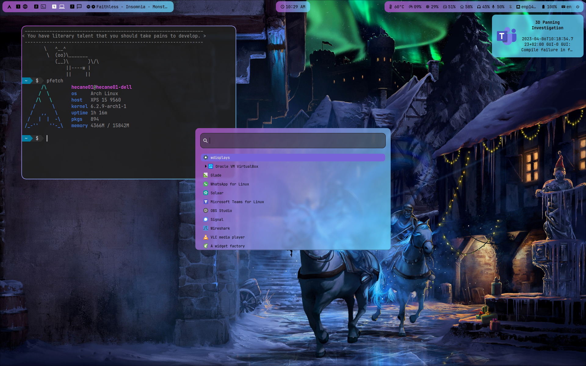

# dotfiles
A collection of my configuration files for Arch Linux.

## Dependencies

* [yaru-gtk-theme](https://aur.archlinux.org/packages/yaru-gtk-theme/)
* [papirus-icon-theme](https://www.archlinux.org/packages/community/any/papirus-icon-theme/)
* [bibata-cursor-theme](https://aur.archlinux.org/packages/bibata-cursor-theme)
* [nerd-fonts-complete](https://aur.archlinux.org/packages/nerd-fonts-complete)
* [powerline-shell](https://aur.archlinux.org/packages/powerline-shell/)
* [polkit-gnome](https://archlinux.org/packages/community/x86_64/polkit-gnome/)
* [pipewire](https://archlinux.org/packages/extra/x86_64/pipewire/)
* [pamixer](https://archlinux.org/packages/community/x86_64/pamixer/)
* [playerctl](https://www.archlinux.org/packages/community/x86_64/playerctl/)
* [blueman](https://archlinux.org/packages/community/x86_64/blueman/)
* [hyprland](https://aur.archlinux.org/packages/hyprland/)
* [swayidle](https://archlinux.org/packages/community/x86_64/swayidle/)
* [foot](https://archlinux.org/packages/community/x86_64/foot/)
* [waybar](https://archlinux.org/packages/community/x86_64/waybar/)
* [mako](https://archlinux.org/packages/community/x86_64/mako/)
* [wofi](https://archlinux.org/packages/community/x86_64/wofi/)
* [eww-wayland](https://aur.archlinux.org/packages/eww-wayland)
* [gtklock](https://aur.archlinux.org/packages/gtklock)
* [wdisplays](https://aur.archlinux.org/packages/wdisplays/)
* [light](https://archlinux.org/packages/community/x86_64/light/)
* [grim](https://archlinux.org/packages/community/x86_64/grim/) & [slurp](https://archlinux.org/packages/community/x86_64/slurp/) & [swappy](https://archlinux.org/packages/community/x86_64/swappy/)
* [cava](https://aur.archlinux.org/packages/cava)
